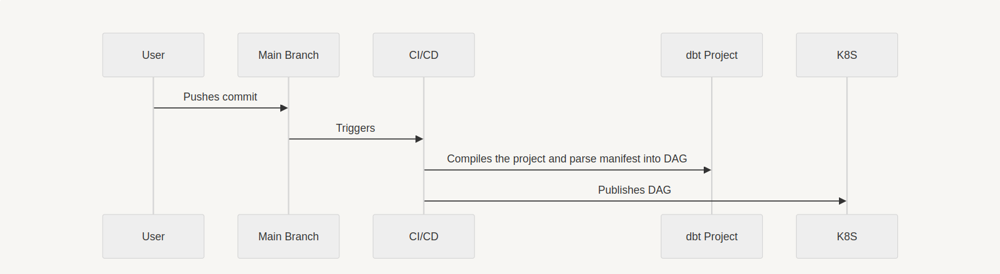

# Documentação do fluxo de orquestração do projeto dbt

<!-- START doctoc generated TOC please keep comment here to allow auto update -->
<!-- DON'T EDIT THIS SECTION, INSTEAD RE-RUN doctoc TO UPDATE -->
**Índice**

- [Documentação do fluxo de orquestração do projeto dbt](#documenta%C3%A7%C3%A3o-do-fluxo-de-orquestra%C3%A7%C3%A3o-do-projeto-dbt)
    - [Introdução](#introdu%C3%A7%C3%A3o)
    - [Informações Gerais](#informa%C3%A7%C3%B5es-gerais)
    - [Configuração e execução](#configura%C3%A7%C3%A3o-e-execu%C3%A7%C3%A3o)
    - [Fluxo de tarefas](#fluxo-de-tarefas)

<!-- END doctoc generated TOC please keep comment here to allow auto update -->

## Introdução

A responsabilidade principal deste fluxo de CI/CD é otimizar o desenvolvimento de projetos dbt, assegurando que a criação de DAGs seja feita de maneira eficiente e sem redundâncias. Ao automatizar a compilação e o deployment dos projetos, o fluxo elimina a necessidade de recriação manual de DAGs, permitindo que a equipe de Engenharia de Dados se concentre mais nas melhorias das transformações de dados. Isso não só aumenta a produtividade como também garante que os dados sejam processados de forma mais rápida e confiável, alavancando a qualidade das análises e insights gerados.

## Informações Gerais

- **Descrição:** Este processo envolve a criação de DAGs (Directed Acyclic Graphs), que são estruturados para passar por diversas tarefas definidas. Essas tarefas processam todos os modelos e testes do dbt que foram pré-definidos, de acordo com os projetos desenvolvidos. Os DAGs são configurados para serem executados periodicamente, garantindo que os dados sejam processados de maneira contínua e eficiente.

- **Agendamento:** O fluxo é configurado para ocorrer diariamente, seguindo o padrão estabelecido pelo Apache Airflow, o que permite uma execução automatizada e regular, essencial para manter a consistência e a atualização dos dados processados.

- **Autor:** [Matheus Beltrami](https://gitlab.com/MBeltrami_dex)

- **Versão:** 1.0

- **Data de Criação:** a definir

## Configuração e execução

### Passo 1: Criar e Ativar um Ambiente Virtual

Este passo envolve a criação e ativação de um ambiente virtual para a instalação, definição e configuração do seu projeto DBT. Supondo que o Airflow e o banco de dados já estejam previamente configurados, seguimos com as instruções abaixo:

#### Virtual Environment

A seguir, o passo a passo dos comandos para criação e ativação do ambiente virtual:

- **Instalar o `virtualenv`:**

    ```bash
    pip install virtualenv
    ```

    Este comando instala o pacote `virtualenv` provido pelo Python.
<br>
- **Criar o ambiente virtual:**

    ```bash
    virtualenv <nome_do_virtual_env>
    ```

    Substitua `<nome_do_virtual_env>` pelo nome desejado para o ambiente virtual. Este comando cria o ambiente virtual no diretório atual.
<br>
- **Ativar o ambiente virtual:**

    ```bash
    source <nome_do_virtual_env>/bin/activate
    ```

    Este comando ativa o ambiente virtual localmente. Para Windows, use:

    ```bash
    <nome_do_virtual_env>\Scripts\activate
    ```

#### Projeto DBT

A seguir, o passo a passo dos comandos para instalação do DBT e do provedor que utilizaremos para o projeto, que é o **dbt-postgres**.

Para garantir que o Apache Airflow consiga acessar e executar os modelos do dbt, é essencial que o projeto dbt seja colocado dentro do diretório plugins do Airflow. O Airflow tem acesso direto aos arquivos localizados nas pastas dags e plugins, e dessa forma, a estrutura correta do diretório deve ser respeitada.

- **Instalar DBT e dbt-postgres:**

    ```bash
    pip install dbt-postgres
    ```

    Este comando instala o DBT e o provedor Postgres, respectivamente. Durante esta etapa, pode ser solicitado alguns dados referentes ao banco de dados ao qual você deseja se conectar. Esses dados podem ser configurados posteriormente no arquivo **profiles.yml** caso não estejam prontos no momento.
<br>

- **Estrutura do Projeto DBT:**

    Resaltando, especificamente para essa automação, o projeto dbt deve ser colocado no caminho `plugins/<nome_do_projeto_dbt>`. Isso permite que o Airflow execute as tarefas do dbt corretamente, garantindo que os modelos sejam processados conforme necessário.

    - Os modelos DBT devem ser armazenados no diretório: `<nome_do_projeto_dbt>/models`.
    - Os testes são definidos no arquivo: `*_tests.yml`.

### Observações Finais

- Certifique-se de que todas as dependências e configurações necessárias para o Airflow e o banco de dados estejam previamente configuradas para garantir a integração correta do DBT.
- A ativação do ambiente virtual deve ser repetida toda vez que você iniciar uma nova sessão de trabalho no projeto para garantir que todas as dependências corretas sejam usadas.

## Fluxo de tarefas

o fluxo de integração e entrega contínuas (CI/CD) para um projeto DBT com Kubernetes (K8S) é considerado um fluxo simples, a figura 1 a seguir demonstra de forma intuitiva esse fluxo:

<center> <b>Figura 01:</b> Fluxo de orquestração do projeto dbt.</center>



O diagrama ilustra o fluxo de integração e entrega contínuas (CI/CD) para um projeto DBT com Kubernetes (K8S). Vamos descrever cada etapa detalhadamente:

### Descrição Detalhada do Fluxo

1. **User (Usuário):**
   - O usuário é o ponto de partida. Ele faz modificações no código do projeto e, em seguida, realiza um commit dessas alterações.
   O pipeline de CI/CD será executado apenas para as branches main e development, que possuem uma configuração associada ao Airflow. Como ambas as branches são protegidas, a ação que desencadeará a execução do pipeline será um Merge Request (MR).
<br>

2. **Main Branch :**
   - O commit feito pelo usuário é enviado para a main do repositório de código. Este é o local central onde o código-fonte do projeto é mantido.
<br>

3. **CI/CD:**
   - A ação de commit na main dispara automaticamente um pipeline de CI/CD (Continuous Integration/Continuous Deployment). O CI/CD é responsável por automatizar o processo de integração e entrega do código.
<br>

4. **Compiles the project and parse manifest into DAG (Compila o projeto e analisa o manifesto para criar um DAG):**
   - O sistema de CI/CD compila o projeto DBT. Durante essa etapa de compilação, é gerado o arquivo de manifesto com o modelo presente no repositório (após a aplicação das modificações do usuário), assim ele lê e analisa o manifesto do DBT para gerar um DAG. O DAG representa a sequência de tarefas (tasks) que precisam ser executadas para processar os dados conforme definido no projeto DBT.

   **Observação:** A seguir, temos um link para a documentação do manifesto: <https://docs.getdbt.com/reference/artifacts/manifest-json>.
<br>

5. **Publishes DAG (Publica o DAG):**
   - Após a criação do DAG, o CI/CD irá commitar as mesmas geradas no próprio repositório do projeto, assim ele é publicado e disponibilizado para execução. Isso garante que todas as etapas do processamento de dados estejam prontas para serem executadas.
<br>

### Resumo das Interações

- **User -> Main Branch:** O usuário faz um commit que é enviado para o main.
- **Main Branch -> CI/CD:** O commit na main dispara o pipeline de CI/CD.
- **CI/CD -> DAG:** O sistema de CI/CD compila o projeto e gera um DAG a partir do manifesto do DBT.
- **DAG -> K8S:** O DAG é publicado e o Kubernetes executa as tarefas definidas no DAG.
